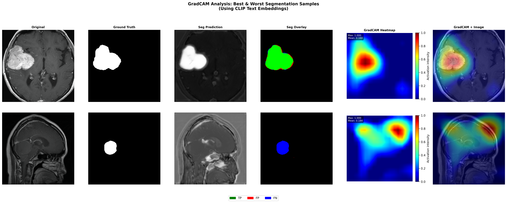

# 🩺 SGCA-UNet: Semantic-Geometric Coherence Attention U-Net for Joint Medical Image Segmentation and Classification

📄 **Accepted at the MICCAI 2026 Workshop on Efficient Medical AI (EMA 2026)**

---

## 📝 Overview

This repository contains the **official PyTorch implementation** of our paper:

**SGCA-UNet: Semantic-Geometric Coherence Attention U-Net for Joint Segmentation and Classification of Medical Images**

We propose **SGCA-UNet**, a lightweight **Vision-Language multi-task framework** that performs **medical image segmentation and classification simultaneously** within a single network.

Unlike conventional multi-task architectures that rely on large transformer backbones or separate segmentation and classification models, SGCA-UNet introduces a novel **Semantic-Geometric Coherence Attention (SGCA)** module that aligns **CLIP semantic embeddings** with **Sobel-based geometric edge information** through a lightweight coherence-guided attention mechanism.

Furthermore, an **uncertainty-aware fusion strategy** dynamically balances visual and semantic information, enabling robust predictions while maintaining an exceptionally small computational footprint.

Despite containing only **6.42 million parameters**, SGCA-UNet achieves **state-of-the-art performance** across multiple medical imaging benchmarks while remaining suitable for deployment in **resource-constrained clinical environments**.

---

## 🚀 Key Contributions

- Lightweight **multi-task U-Net** for simultaneous segmentation and classification
- Novel **Semantic-Geometric Coherence Attention (SGCA)** module
- Integration of **CLIP semantic embeddings** with **Sobel edge features**
- Lightweight **uncertainty-aware multimodal fusion**
- Parameter-efficient Vision-Language framework (**6.42M parameters**)
- State-of-the-art performance on multiple medical image datasets

---

## 🏗️ Model Architecture

  

The proposed architecture consists of:

- U-Net encoder-decoder backbone
- Multi-scale **SGCA modules**
- CLIP text embedding guidance
- Sobel-based geometric feature extraction
- Uncertainty-aware semantic-visual fusion
- Shared bottleneck for joint segmentation and classification

---

## 🧠 Semantic-Geometric Coherence Attention (SGCA)

The proposed SGCA module bridges **semantic knowledge** and **geometric structures** through three complementary branches:

### 🔹 Semantic Branch
- Projects CLIP text embeddings into the visual feature space
- Provides disease-aware semantic guidance

### 🔹 Geometric Branch
- Extracts boundary information using parameter-free Sobel filters
- Preserves structural lesion information

### 🔹 Coherence Attention
- Computes semantic-geometric agreement using cosine similarity
- Suppresses inconsistent features while enhancing reliable representations

### 🔹 Uncertainty-aware Fusion
- Estimates visual and semantic uncertainty
- Dynamically balances multimodal information during feature fusion

  

---

## 📂 Datasets

The proposed framework is evaluated on three challenging medical imaging benchmarks:

### 🧠 BRISC2025
- Brain tumor segmentation and classification
- Four classes:
  - Glioma
  - Meningioma
  - Pituitary
  - No Tumor

### 🩺 ISIC 2017
- Skin lesion segmentation
- Dermoscopic images

### 🩺 ISIC 2016
- Skin lesion analysis benchmark

---

## 📈 Performance

### BRISC2025

| Metric | Value |
|---------|-------|
| Classification Accuracy | **98.84%** |
| Dice Score | **0.8210** |
| IoU | **0.7241** |
| HD95 | **9.36** |

---

### ISIC 2017

| Metric | Value |
|---------|-------|
| Classification Accuracy | **99.84%** |
| Dice Score | **0.9011** |
| IoU | **0.8298** |
| HD95 | **18.30** |

---

### ISIC 2016

| Metric | Value |
|---------|-------|
| Classification Accuracy | **82.32%** |
| Dice Score | **0.8914** |
| IoU | **0.8184** |
| HD95 | **26.95** |

---

## 📊 Qualitative Results

  

The proposed SGCA-UNet produces highly accurate lesion boundaries while simultaneously predicting disease classes, demonstrating superior localization and classification consistency across multiple datasets.

---

## 🔬 Ablation Study

We perform extensive ablation experiments to validate each component.

The study demonstrates the importance of:

- ✅ Semantic-Geometric Coherence Attention
- ✅ Sobel Edge Branch
- ✅ Multi-head Coherence Module
- ✅ Uncertainty-aware Fusion

Even though these modules introduce only minimal additional parameters, they consistently improve segmentation accuracy and classification performance.

---

## ⚙️ Experimental Setup

- Framework: **PyTorch**
- GPU: **NVIDIA Tesla T4 (16 GB)**
- Optimizer: **AdamW**
- Scheduler: **Cosine Annealing**
- Epochs: **100**
- Image Resolution: **256 × 256**
- Total Parameters: **6.42 Million**

---

## 📉 Model Efficiency

| Model | Parameters |
|---------|-----------|
| **SGCA-UNet (Ours)** | **6.42M** |
| DeepLabV3+ | 41M |
| TransUNet | 86M |

Our framework achieves **state-of-the-art segmentation and classification performance** while requiring **an order of magnitude fewer parameters** than transformer-based approaches.

---

## 📌 Features

- Joint Segmentation + Classification
- Vision-Language Learning
- CLIP-guided Semantic Attention
- Sobel-based Geometric Features
- Multi-head Coherence Attention
- Lightweight Deployment
- Uncertainty-aware Fusion
- End-to-End Training

---

## ✍️ Authors

- **Rajdeep Pal** – St. Thomas' College of Engineering and Technology, India
- **Jotiraditya Banerjee** – Jadavpur University, India
- **Soumyajit Gayen** – National Institute of Technology Rourkela, India
- **Dmitrii Kaplun** – Saint Petersburg Electrotechnical University "LETI", Russia & China University of Mining and Technology
- **Ram Sarkar** – National Institute of Technology Rourkela, India

---

## ⚠️ Disclaimer

This repository is released **for academic research purposes only**.

- This model is **not intended for clinical diagnosis**.
- Performance is evaluated on publicly available benchmark datasets.
- Real-world deployment requires extensive clinical validation and regulatory approval.

---

## 📄 Paper

**SGCA-UNet: Semantic-Geometric Coherence Attention U-Net for Joint Segmentation and Classification of Medical Images**

📍 Accepted at **MICCAI 2026 Workshop on Efficient Medical AI (EMA 2026)**

---

## ⭐ Citation

---

## 📬 Contact

**Rajdeep Pal**

📧 rajdeeppal167@gmail.com
